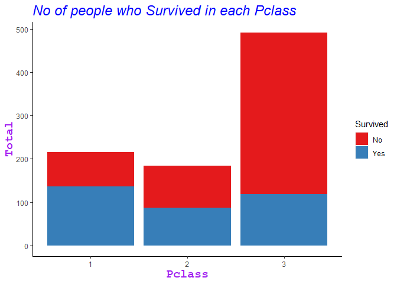
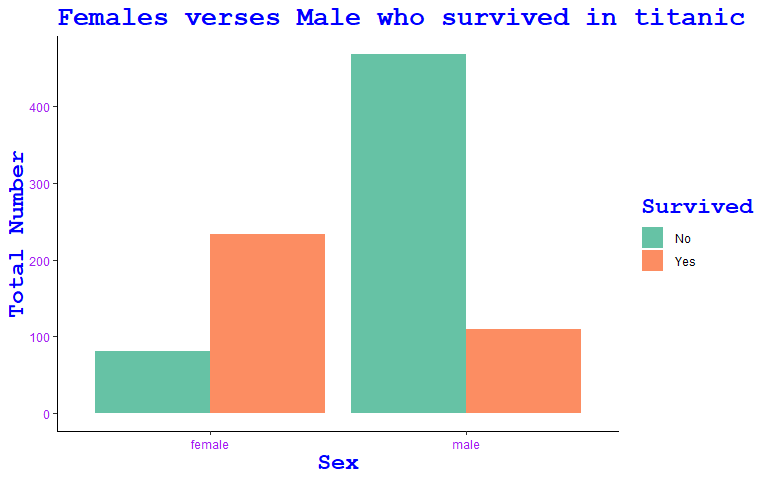
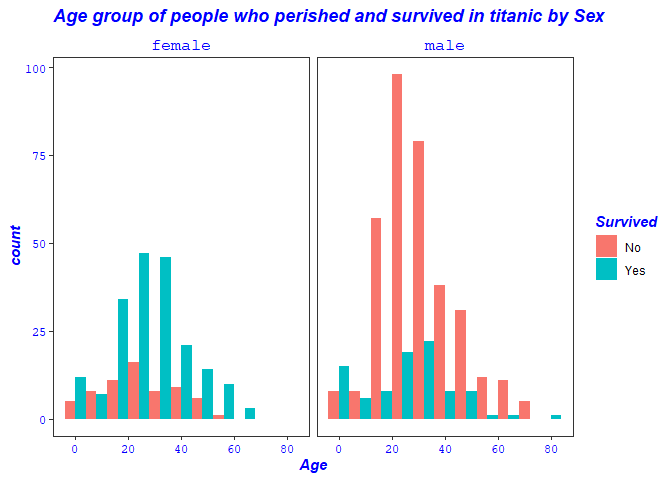
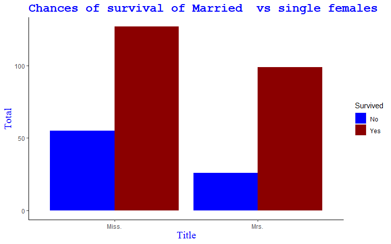
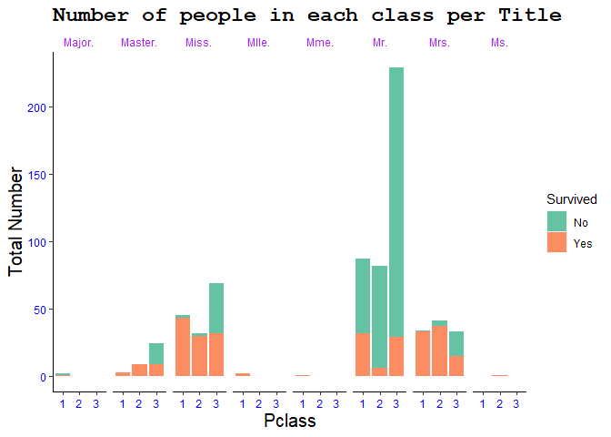

# EXPLORATORY ANALYSIS OF TITANIC SURVIVAL.
##### by Berndatte

## SYNOPSIS

RMS Titanic was a British passenger liner operated by the White Star Line.It sank in the North Atlantic Ocean in the early morning hours of 15 April 1912, after striking an iceberg during her maiden voyage from Southampton to New York.This caused 1502 deaths out of 2224 passengers and crew, this was due to lack of enough lifeboats for everyone on board.

We use the data from Kaggle to explore the survival based on the gender, Proxy for Socio-economic status(SES) either Upper, Middle or Lower class, the Age, and Title for example people with title like Mr., Mrs., Miss., Master., Ms. We find that for the gender, males had a very high chance of perishing to females,If you were in 3rd class you had a low chance of surviving than those in Upper class.

## Loading And Processing of The Raw Data.

The data for this project is in form of a comma-separated-value value,the data is split in two:

- test.csv
- train.csv

which is found in [Titanic data](https://www.kaggle.com/c/titanic/data).

### Reading In The Data


```r
knitr::opts_chunk$set(echo = TRUE)


test <- read.csv("test.csv", header = TRUE)
train <- read.csv("train.csv", header = TRUE)
```

### loading the packages 


```r
library(stringr)
library(tidyverse)
```

```
## -- Attaching packages ------------------------------------------------------------------ tidyverse 1.3.0 --
```

```
## v ggplot2 3.3.0     v purrr   0.3.3
## v tibble  2.1.3     v dplyr   0.8.4
## v tidyr   1.0.2     v forcats 0.4.0
## v readr   1.3.1
```

```
## -- Conflicts --------------------------------------------------------------------- tidyverse_conflicts() --
## x dplyr::filter() masks stats::filter()
## x dplyr::lag()    masks stats::lag()
```


### Processing of Data


```r
#adding a Survived column in test dataset
test_surv <- data.frame(Survived = rep("None",nrow(test)),test[,])

#combining test and train data frames
combinedData <- rbind(train,test_surv)

#looking at the data 
str(combinedData)
```

```
## 'data.frame':	1309 obs. of  12 variables:
##  $ PassengerId: int  1 2 3 4 5 6 7 8 9 10 ...
##  $ Survived   : chr  "0" "1" "1" "1" ...
##  $ Pclass     : int  3 1 3 1 3 3 1 3 3 2 ...
##  $ Name       : Factor w/ 1307 levels "Abbing, Mr. Anthony",..: 109 191 358 277 16 559 520 629 417 581 ...
##  $ Sex        : Factor w/ 2 levels "female","male": 2 1 1 1 2 2 2 2 1 1 ...
##  $ Age        : num  22 38 26 35 35 NA 54 2 27 14 ...
##  $ SibSp      : int  1 1 0 1 0 0 0 3 0 1 ...
##  $ Parch      : int  0 0 0 0 0 0 0 1 2 0 ...
##  $ Ticket     : Factor w/ 929 levels "110152","110413",..: 524 597 670 50 473 276 86 396 345 133 ...
##  $ Fare       : num  7.25 71.28 7.92 53.1 8.05 ...
##  $ Cabin      : Factor w/ 187 levels "","A10","A14",..: 1 83 1 57 1 1 131 1 1 1 ...
##  $ Embarked   : Factor w/ 4 levels "","C","Q","S": 4 2 4 4 4 3 4 4 4 2 ...
```

```r
table(combinedData$Sex)
```

```
## 
## female   male 
##    466    843
```

```r
table(combinedData$Survived)
```

```
## 
##    0    1 None 
##  549  342  418
```

```r
table(combinedData$Pclass)
```

```
## 
##   1   2   3 
## 323 277 709
```

```r
#changing the class of Survived,PClass and Name variables
combinedData$Survived <- as.factor(combinedData$Survived)
combinedData$Pclass <- as.factor(combinedData$Pclass)
combinedData$Name <- as.character(combinedData$Name)
summary(combinedData)
```

```
##   PassengerId   Survived   Pclass      Name               Sex     
##  Min.   :   1   0   :549   1:323   Length:1309        female:466  
##  1st Qu.: 328   1   :342   2:277   Class :character   male  :843  
##  Median : 655   None:418   3:709   Mode  :character               
##  Mean   : 655                                                     
##  3rd Qu.: 982                                                     
##  Max.   :1309                                                     
##                                                                   
##       Age            SibSp            Parch            Ticket    
##  Min.   : 0.17   Min.   :0.0000   Min.   :0.000   CA. 2343:  11  
##  1st Qu.:21.00   1st Qu.:0.0000   1st Qu.:0.000   1601    :   8  
##  Median :28.00   Median :0.0000   Median :0.000   CA 2144 :   8  
##  Mean   :29.88   Mean   :0.4989   Mean   :0.385   3101295 :   7  
##  3rd Qu.:39.00   3rd Qu.:1.0000   3rd Qu.:0.000   347077  :   7  
##  Max.   :80.00   Max.   :8.0000   Max.   :9.000   347082  :   7  
##  NA's   :263                                      (Other) :1261  
##       Fare                     Cabin      Embarked
##  Min.   :  0.000                  :1014    :  2   
##  1st Qu.:  7.896   C23 C25 C27    :   6   C:270   
##  Median : 14.454   B57 B59 B63 B66:   5   Q:123   
##  Mean   : 33.295   G6             :   5   S:914   
##  3rd Qu.: 31.275   B96 B98        :   4           
##  Max.   :512.329   C22 C26        :   4           
##  NA's   :1         (Other)        : 271
```

```r
#adding a column Title and calling the new data frame CombinedData1
combinedData1 <- 
  combinedData %>% 
  mutate(Title = str_extract(Name, "M\\w{1,5}?\\."))

head(combinedData1)
```

```
##   PassengerId Survived Pclass
## 1           1        0      3
## 2           2        1      1
## 3           3        1      3
## 4           4        1      1
## 5           5        0      3
## 6           6        0      3
##                                                  Name    Sex Age SibSp Parch
## 1                             Braund, Mr. Owen Harris   male  22     1     0
## 2 Cumings, Mrs. John Bradley (Florence Briggs Thayer) female  38     1     0
## 3                              Heikkinen, Miss. Laina female  26     0     0
## 4        Futrelle, Mrs. Jacques Heath (Lily May Peel) female  35     1     0
## 5                            Allen, Mr. William Henry   male  35     0     0
## 6                                    Moran, Mr. James   male  NA     0     0
##             Ticket    Fare Cabin Embarked Title
## 1        A/5 21171  7.2500              S   Mr.
## 2         PC 17599 71.2833   C85        C  Mrs.
## 3 STON/O2. 3101282  7.9250              S Miss.
## 4           113803 53.1000  C123        S  Mrs.
## 5           373450  8.0500              S   Mr.
## 6           330877  8.4583              Q   Mr.
```

```r
str(combinedData1)
```

```
## 'data.frame':	1309 obs. of  13 variables:
##  $ PassengerId: int  1 2 3 4 5 6 7 8 9 10 ...
##  $ Survived   : Factor w/ 3 levels "0","1","None": 1 2 2 2 1 1 1 1 2 2 ...
##  $ Pclass     : Factor w/ 3 levels "1","2","3": 3 1 3 1 3 3 1 3 3 2 ...
##  $ Name       : chr  "Braund, Mr. Owen Harris" "Cumings, Mrs. John Bradley (Florence Briggs Thayer)" "Heikkinen, Miss. Laina" "Futrelle, Mrs. Jacques Heath (Lily May Peel)" ...
##  $ Sex        : Factor w/ 2 levels "female","male": 2 1 1 1 2 2 2 2 1 1 ...
##  $ Age        : num  22 38 26 35 35 NA 54 2 27 14 ...
##  $ SibSp      : int  1 1 0 1 0 0 0 3 0 1 ...
##  $ Parch      : int  0 0 0 0 0 0 0 1 2 0 ...
##  $ Ticket     : Factor w/ 929 levels "110152","110413",..: 524 597 670 50 473 276 86 396 345 133 ...
##  $ Fare       : num  7.25 71.28 7.92 53.1 8.05 ...
##  $ Cabin      : Factor w/ 187 levels "","A10","A14",..: 1 83 1 57 1 1 131 1 1 1 ...
##  $ Embarked   : Factor w/ 4 levels "","C","Q","S": 4 2 4 4 4 3 4 4 4 2 ...
##  $ Title      : chr  "Mr." "Mrs." "Miss." "Mrs." ...
```

```r
combinedData2 <- combinedData1 %>%
  filter(Survived != "None") %>% 
  mutate(Survived = factor(Survived, levels = c(0,1), labels = c('No', 'Yes')))
```


## RESULTS

1.Finding whether People in upper class had a high chance of surviving than the ones in lower class.


```r
ggplot(combinedData2, aes(Pclass, fill = Survived)) +
  geom_bar() +
 labs(title = "No of people who Survived in each Pclass", y = 'Total')+
  scale_fill_brewer(palette = 'Set1') +
  theme(panel.grid = element_blank(),
        plot.title = element_text(face = "italic", color = "blue", size = 18),
        axis.title = element_text(family = "mono", color = "purple", size = 15, face = 'bold'),
        panel.background = element_rect(fill = "white"),
        axis.line = element_line(color = 'black'))
```

<!-- -->

This shows that if you were a third class person you had a higher chance  to perish  than the person in upper class.

2.Females had a high chance of survival  than males


```r
ggplot(combinedData2, aes(Sex, fill = Survived)) +
  geom_bar(position = "dodge") +
  scale_fill_brewer(palette = 'Set2') +
  labs(title = "Females verses Male who survived in titanic", y = 'Total Number') +
  theme_classic() +
  theme(title = element_text(family = "mono",color = "blue", face = 'bold', size = 17),
        axis.text = element_text(color = "purple"))
```

<!-- -->

Its evident that females survived more than males in titanic ship.

3.The age of the people who perished and survived grouped by Sex.


```r
ggplot(drop_na(combinedData2),aes(Age, fill = Survived)) +
  geom_histogram(position = "dodge", binwidth = 8) +
  facet_grid(.~ Sex) +
  labs(title = "Age group of people who perished and survived in titanic by Sex", 'Total Number') +
  theme_bw() +
  theme(panel.grid = element_blank(),
        strip.background = element_blank(),
        axis.text = element_text(family = 'mono', color = 'blue'),
        title = element_text(face = 'bold.italic', color = 'blue'),
        strip.text = element_text(family = 'mono', color = 'blue',size = 12)
        )
```

<!-- -->

This shows us that more men perished in titanic than females,and the young men aged between 19-24 had
a lower chance of surviving  while the men aged 80 had a higher chance of surviving,and females 
between 20- 38 had a higher chance of surviving.


4.single females had a higher chance of surviving  than the married females


```r
#subseting combinedData2  to get the females with title:-Mrs. and Miss.

  females <- combinedData2 %>%
    filter(Sex == 'female' & Title %in% c('Mrs.', 'Miss.'))

#ploting the females 

ggplot(females,aes(x = Title, fill = Survived)) +
  geom_bar(position = "dodge") +
  scale_fill_manual(values = c('blue', 'darkred'))+
  labs(title = 'Chances of survival of Married  vs single females', y = 'Total' ) +
  theme(panel.background = element_blank(),
        plot.title = element_text(family = 'mono', color = "blue", face = 'bold', size = 18),
        axis.title = element_text(family = 'serif', color = 'blue', size = 15),
        axis.line = element_line(color = 'black'))
```

<!-- -->

To conclude using this plot,it seems that single females were likely to survive than the married females.

5. Extracting the Titles each separately to find out whats the meaning of these titles


```r
combinedData3 <- combinedData2[complete.cases(combinedData2),]
combinedData_all <- combinedData1 %>%
  filter(Title %in% c('Major.', 'Master.', 'Miss.', 'Mr.', 'Mrs.', 'Ms.'))

ggplot(drop_na(combinedData_all), aes(x = Age)) +
  geom_histogram(fill = 'blue', binwidth = 5)+
  facet_grid(. ~ Title) +
  labs(title = 'Ages of people per Title', y = 'Total Number') +
  theme_bw() +
  theme(panel.border = element_rect(colour = 'pink'),
        panel.grid = element_blank(),
        plot.title = element_text(face = 'bold.italic',color = 'purple', size = 18),
        strip.background = element_blank(),
        strip.text = element_text(family = 'mono'),
        axis.title = element_text(family = 'mono', color = 'purple', face = 'bold',size = 15))
```

<!-- -->

we can see here that,Masters are the boys aged below 14 years while MR. are men aged above 15yrs,
men with title 'major were only two aged 45 and 52,Misses. were the females as young as 0.17 yrs to
females of age 63 years, Mrses. are married females.


6. How are Misses.,Mrs.,Mr. and Masters  distributed in classes


```r
ggplot(combinedData3, aes(x = Pclass, fill = Survived)) +
  geom_bar(position = "stack") +
  facet_grid(.~ Title) +
  labs(title = 'Number of people in each class per Title', y = 'Total Number') +
  scale_fill_brewer(palette ='Set2' )+
  theme(panel.grid = element_blank(),
        panel.background = element_blank(),
        strip.background = element_blank(),
        strip.text = element_text(colour = 'purple'),
        axis.text = element_text(color = 'blue'),
        axis.title = element_text(family = 'sans', size = 15),
        plot.title = element_text(family = 'mono', color =  'black', size = 17, face = 'bold'),
        axis.line = element_line(color = 'black'))
```

<!-- -->

The plot show us that all majors were in upper class ,there were few masters in upper class than in middle and lower class. Those in upper and  middle class all survived while in  lower class most people perished than those who survived.
There were more 'Misses' in lower class than in upper and middle class. Those in lower class had equal chances of surviving and perishing while  those in upper and middle class had a higher chance of surviving.
Most of those men with title Mr.were in lower class  than in other classes and they had low chances of surviving.
When we look at the Mrses, they were more in middle class.Those who were in first class had a higher chance of surviving, while those in third class had a equal chance of surviving and perishing.
There was only one person with title Ms. who was in second class and unfortunately perished.


## Conclusion
It is evident from the exploratory  that men had a very low chance of surviving than females,and if you were in lower class you also had a lower chance of surviving,but if you were in upper class you had a very high chance of surviving.


